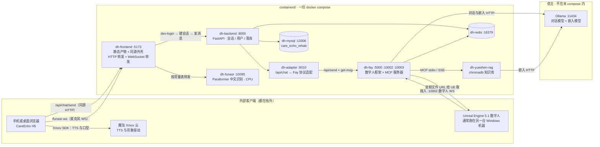

# DigitalHuman · 康养数字人（CareEcho）

一套可复现的**康养数字人栈**：Fay 数字人框架 + FastAPI 业务后端 + 中文语音识别 +
chromadb 知识库 + CareEcho H5 前端，用一份 `docker compose` 起全栈，
LLM 与向量嵌入默认由宿主上的 Ollama 提供（两处都可以独立换成任意 OpenAI 兼容端点 ——
端点与密钥是 `.env` 里按机器变的事，仓库里只留示例值）。

设计上的两条硬规矩，读代码前先知道：

1. **上游仓库工作树始终零改动。** 所有适配都以 `containerd/patches/*.patch` 在构建期打上、
   或以 `containerd/overlay/` 的文件在运行期挂载覆盖。改别人代码的代价是每次上游更新都要重做一遍，
   所以那代价被集中收进一个可复核的目录里（`./run.sh audit` 就是用来核对这条规矩的）。
2. **能力必须被测试件证明，否则不算存在。** 每个服务配一组探针（`containerd/probes/`），
   判据要么通过、要么明确记成 SKIP/降级并写出原因；每条判据还配一个「故意改坏它必须变红」的负面自检。

> 想看**现在接到哪一步、模块之间每一跳走什么协议、慢在哪**，读 [`INTEGRATION.md`](INTEGRATION.md)。
> 权威细节、每个坑的分析和实测数字都在 **[`containerd/README.md`](containerd/README.md)**。
> 本文只讲这套东西由什么组成、怎么起来、以及边界在哪。

## 仓库构成

| 目录 | 是什么 | 上游 | 容器化 |
|---|---|---|---|
| `fay/` | Fay 数字人框架（LLM 编排、MCP、数字人 WS 协议） | fork [`chuan918/Fay`](https://github.com/chuan918/Fay)，`upstream` = [`xszyou/Fay`](https://github.com/xszyou/Fay) | ✅ `dh-fay` |
| `service/` | 康养业务后端（FastAPI + MySQL + Redis，自带 pytest） | 自有 | ✅ `dh-backend` + `dh-adapter` |
| `frontend/` | CareEcho H5（Vue 3 + Vite）与微信小程序壳 | gitee [`xie-zha-zha/carecho_final`](https://gitee.com/xie-zha-zha/carecho_final) | ✅ `dh-frontend`（只发 H5） |
| `ue/` | Unreal Engine 5.1 数字人模型工程 | 自有 | ❌ 见「不进容器的东西」 |
| `containerd/` | 全部 Docker 封装：镜像、补丁、覆盖、探针、测试、入口脚本 | —— | 唯一入口 |

`fay/ service/ ue/ frontend/ containerd/` 以 **git submodule** 记录各自上游的精确 commit 作为溯源。

```bash
git clone --recursive https://github.com/greenhandzdl/DigitalHuman.git
# 已 clone 过则：git submodule update --init --recursive
# 某个 submodule 的远端地址换过时（fay 换过）：
git submodule sync -- fay && git submodule update --init --recursive
```

Fay 的上游**不是**一份并排的拷贝，而是 `fay/` 仓库里的一个 remote：`origin` 指 fork，
`upstream` 指 `xszyou/Fay`。跟上游走靠合并 —— `cd containerd && ./run.sh upstream` 会 fetch 一次、
报落后几条，并把每份 fay 补丁对 `upstream/main` 干跑预检（贴不上就非零退出，等于把「补丁会不会被上游漂移
废掉」变成一条能进 CI 的断言）。

## 架构



三个容易看错的地方：

- **UE 只拨进来，Fay 从不外拨。** 数字人那条 WS 的方向是 UE → `:10002`；
  但 Fay 回给 UE 的**音频下载地址**是拼在文本里的一个 URL，取自 `fay_url` ——
  那是跨机部署唯一真正会咬人的地方，见「档位与跨机流量」。
- **H5 只与自己的同源地址说话。** 页面既不指后端也不指 Fay，全部经 `:5173` 那个外壳转发；
  麦克风那条 `ws` 也一样（生产构建里没有 Vite 的 dev proxy，所以这层转发必须由外壳提供）。
- **Xmov 那一跳发生在浏览器里**，不经过本栈任何容器。它的密钥是构建期内联进产物的，
  默认留空（见「不进容器的东西」一节）。

## 服务与端口

端口策略只有一个开关：`.env` 里的 `DH_ENV`（`prod` 缺省 / `dev`）。

| 服务 | 容器内 | prod（`./run.sh up`） | dev（`./run.sh dev`） |
|---|---|---|---|
| `dh-frontend` | 8080 | `127.0.0.1:5173` | `0.0.0.0:5173` |
| `dh-backend` | 8000 | `127.0.0.1:8000` | `0.0.0.0:8000` |
| `dh-adapter` | 8010 | `127.0.0.1:8010` | `0.0.0.0:8010` |
| `dh-fay` | 5000 / 10002 / 10003 | 三个都 `127.0.0.1` | 三个都 `0.0.0.0`，另加 5010 / 8765 / 10001 / 音频桥 10199 |
| `dh-yueshen-rag` | 8766 | **不发布**（只走 compose 内网） | `:8766` |
| `dh-funasr` | 10095 | **不发布**（只经 5173 同源转发） | `:10095` |
| `dh-mysql` | 3306 | `127.0.0.1:13306` | `0.0.0.0:13306` |
| `dh-redis` | 6379 | `127.0.0.1:16379` | `0.0.0.0:16379` |

渲染出来是 prod **8 条端口全是 `127.0.0.1`**、dev **14 条全是 `0.0.0.0`**，一条例外都没有
（`docker compose ... config | grep host_ip` 复核，命令在 `containerd/README.md` 的档位一节）。

两条边界是刻意的，不是没来得及做：

- **loopback 这件事只由档位保证，不由某一行写死保证。** `prod` 下把 `BIND_ADDR` 改成
  `0.0.0.0` 或某个局域网地址，`./run.sh up` 直接报错退出；`dev` 则按设计就是绑 `0.0.0.0` 全开。
  所以"数据库不出本机"在 prod 下照样成立，而 dev 期间的代价照实写：
  同网段任何机器都敲得到 `13306`/`16379`，进去的门槛只剩那一发口令 ——
  跨机联调用完 `./run.sh down`。`:5000` 一离开 loopback 就同时暴露 Fay 的管理台和它的
  无鉴权 OpenAI 兼容 façade，这条纪律在 dev 下是**已知被吃掉的代价**，不是没想到。
- 曾经有过的"dev 只放开某一个地址"那一档（`DH_EXTRA_BIND` + 一份 `docker-compose.dev.extra.yml`）
  已经在 2026-09-22 撤掉：它能表达的事，绑 `0.0.0.0` 之后都能表达，而它多出来的那套
  "挑地址"的心智负担会让每一次跨机联调都要先判断该填哪个网卡。

## 快速开始

```bash
cd containerd
cp .env.example .env        # 或直接 ./run.sh up —— 首次会自动生成随机 DB 口令与 JWT 密钥

./run.sh up                 # 构建 + 起全栈（首次约 3~6 分钟；dh-funasr 那 1.57 GiB 镜像与模型缓存另算，见下）
./run.sh smoke              # 端到端冒烟：后端 → adapter → Fay → Ollama → 回库
./run.sh test               # 全套测试件（14 组，见 containerd/README.md）
./run.sh test asr-test      # 只跑其中一组
./run.sh dev                # dev 档位：端口一律绑 0.0.0.0 全开，给手机 / 另一台机器连（含 13306/16379，用完 down）
./run.sh audit              # 核账：四个上游仓库是否仍零改动，并列出 containerd 侧产物
./run.sh upstream           # 与 Fay 上游对表：落后几条 + 补丁能否照贴
./run.sh kbslice            # 把项目方语料包切成知识库语料（换语料才跑）
./run.sh kb                 # 语料入库 + 用真实问法抽测检索
./run.sh kbq                # 从业务口问一句，判那一问的回帧里知识库有没有真被用上
./run.sh asr-seed           # 本机若已有别的 FunASR 缓存，拷过来省 1.3GB 下载
./run.sh logs funasr        # 看某个服务的日志（fay/backend/adapter/frontend/funasr/mysql/redis）
```

`dh-funasr` 首次启动会从 ModelScope 下载约 **1.3GB** 的三个模型
（paraformer-large + fsmn-vad + ct-punc），缓存落在命名卷 `funasr-cache`；
健康检查为此给了 300s 的 `start_period`，所以「前端起来了但麦克风还打不开」在首次是正常中间态。

## 档位与跨机流量

`./run.sh dev` 与 `./run.sh up` 起的是**同一套服务**，差别只在多叠一个
`docker-compose.dev.yml`（追加 Fay 那几个内网口、给后端 `DEBUG=true`、把 `FAY_URL` 指向本机地址），
外加 `run.sh` 在 dev 分支把 `BIND_ADDR` 导成 `0.0.0.0`。
`DH_ENV` 不出现在业务代码里，它只决定 compose 文件列表和 `BIND_ADDR` 的落点。

让跑在另一台电脑上的 UE 连进来需要三件事，脚本末尾会把它们直接打出来：

1. 端口进得来 → `dev` 档位把 `BIND_ADDR` 覆盖成 `0.0.0.0`：本机每个地址都收，
   于是"对端从哪张网卡来"这件事不需要事先判断。
   （探测出的局域网 IP 仍然要用，但用在别处：`FAY_URL` 与横幅里那个可点开的地址。
   要走 tailscale 之类的虚拟网卡就自己在 `.env` 里填 `DH_LAN_IP` —— 它是按机器变的事，不进仓库。）
2. UE 拿到的音频地址可达 → `containerd/patches/fay/0007-fay-url-env-overridable-CRLF-source.patch`
   让 `fay_url` 能被环境变量 `FAY_URL` 覆盖；不设时完全等于上游原行为。
3. 一个稳定名字 → 栈内容器要用 `ws://dh-host:10002` 这类写法时，`docker-compose.yml` 的
   `extra_hosts` 在**容器内**提供 `dh-host` / `ue-host` 两条映射；宿主机侧要 UE 也认这个名字，
   才在 Windows 的 `C:\Windows\System32\drivers\etc\hosts` 加一行 `<本机 LAN IP>  dh-host`。
   嫌麻烦就直接填 IP，效果一样。

`getUserMedia`（麦克风）只在 **https 或 localhost** 算安全上下文。所以从手机用
`http://<局域网 IP>:5173` 打开页面时，聊天照常，但麦克风按钮一定失败 —— 这不是本栈的缺陷，
是浏览器的规则；要真机测语音得走 https 或用 USB 调试的 localhost 转发。

## 不进容器的东西

- **`ue/`**：UE5.1 的蓝图内容工程（`shuziren.uproject`）。实测不含引擎本体、
  `PlatformAllowList` 多为 `Win64`、全树 0 个预编译二进制、5 个插件要 Epic Marketplace 授权，
  且端点级引用 Fay `10002` 协议为 0 处 —— 这个工程从未实现过与 Fay 的对接。
  Linux 无头容器与它不兼容，因此改为在 `containerd` 里用一个只读的 `ue-audit` 容器做
  **构建完整性体检**（描述符可解析 + 每个插件模块的 `Source/` 目录都在），
  把「为什么不能容器化」变成可复核的数字而不是一句断言。
- **微信小程序壳 `frontend/careecho-h5-wc`**：它要求 H5 部署在**已备案的 https 域名**上，
  那是发布资质问题而不是集成问题，本栈不代发。
- **Xmov 的密钥**：`VITE_XMOV_APP_ID` / `VITE_XMOV_APP_SECRET` 是构建期内联进产物的
  （伙伴方代码读 `import.meta.env`，运行期换 env 不生效）。默认留空 → 产物走它自己的
  「缺少 Xmov APP_ID」分支，数字人区域显示占位提示、聊天与语音识别照常。
  要填就自己在 `docker build --build-arg` 上给，但注意 ARG 值会留在镜像 history 里。
- **宿主 Ollama**：LLM 与向量嵌入的默认落点（`http://host.docker.internal:11434`）。
  本栈有两处**没有**走它，都是明写的例外：
  - 语音识别 —— Ollama 的 `/api/chat` 只收 `text` + `images`，**没有音频输入口**，
    模型清单里也没有 paraformer，所以 `dh-funasr` 自建镜像自己推理。
  - TTS 与形象驱动 —— 那是浏览器里的 Xmov 云 SDK，从架构上就不在这台机器上。

## 安全

- `containerd/.env` 是本地实值密钥（DB 口令、JWT 签名密钥），已被 `.gitignore` 忽略，不入库。
  首次运行 `run.sh` 会由 `tools/gen_keys.py` 从 `.env.example` 生成随机值。
- 两个公开仓库（`DigitalHuman` 与 `DigitalHuman-containerd`）都不含项目方语料、
  伙伴方数据或任何密钥；`seed/kb_corpus/` 一类的切片产物只在本地。
- `prod` 的 `BIND_ADDR` 硬闸、FunASR 与 yueshen 在 prod 不发布宿主端口，是同一件事的两面：
  **默认档位只留必要口，放开必须是显式决定（`./run.sh dev`）**。放开之后管理口与应用口一起出去，
  这件事写在档位说明里而不是藏起来 —— `dev` 不是"更宽松的同一种部署"，是一次有代价的临时暴露。
- `.env` 里除密钥之外还有一类**按机器变的事**：LLM/嵌入的端点与 token、对端真能取到的本机地址。
  它们只出现在 `.env`，仓库里那两份 `system.conf` / `.env.example` 一律只给"在这台机器上跑得起来"的
  示例值 —— 否则换一次部署就得改一次被 git 跟踪的文件，而历史里会留下上一台机器的地址。
- 外壳的 WebSocket 转发是**常量表**（`CARECHO_WS_RELAY="路径=上游"`，精确匹配、丢 query），
  客户端给的 path 永远不进 `getaddrinfo`，所以它不是开放代理，也就不能被当开放代理用。

## 许可与致谢

上游代码各自遵循其仓库的许可（Fay、CareEcho H5、`service/`），本仓库不替它们重新声明。
`containerd/` 这层封装**目前没有附独立许可证文件** —— 需要的话请先明确它再分发，
不要因为「看起来像示例」就当它是公共领域。

需要特别对待的是别人的东西：伙伴方的 H5 与项目方语料不进本仓库，
`seed/kb_corpus/`、`.env`、模型缓存也都不该进 —— 这一点由 `./run.sh audit` 与提交前的自查把着。
